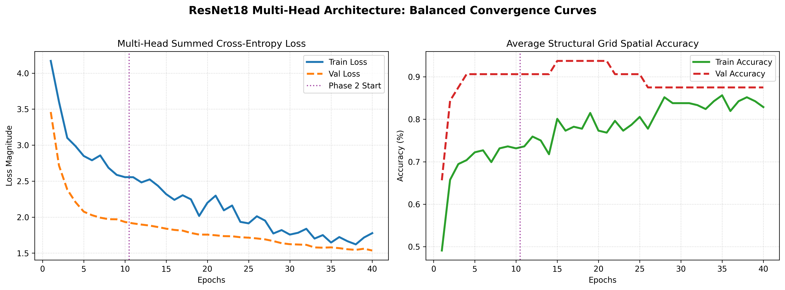
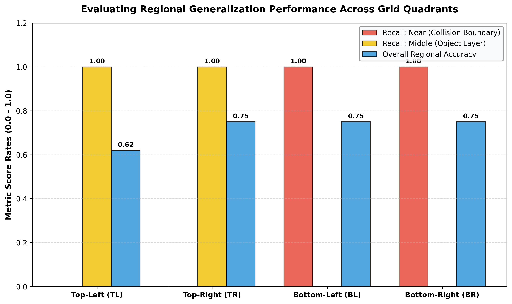
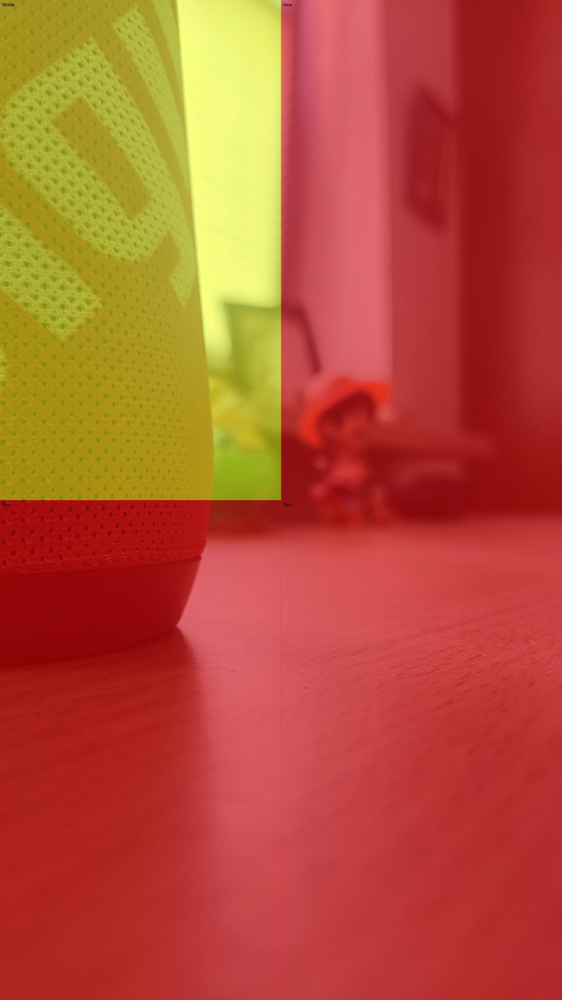
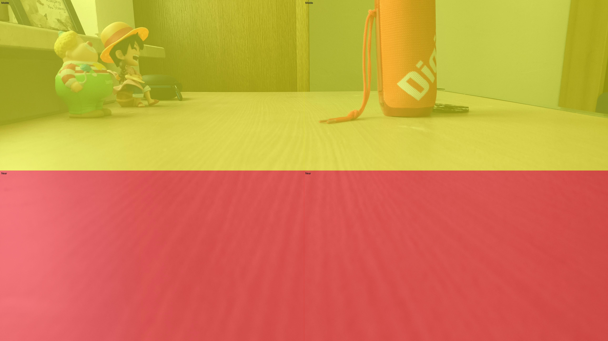
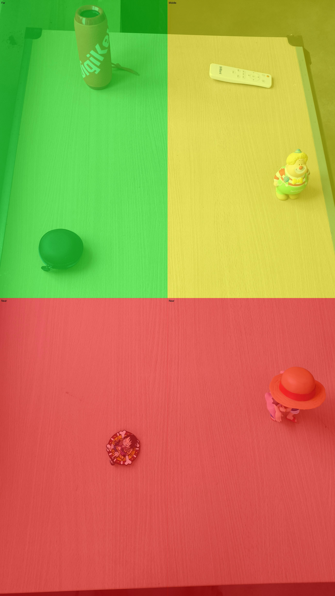
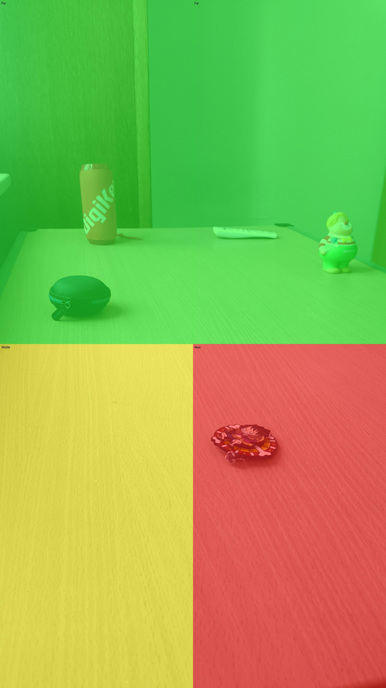
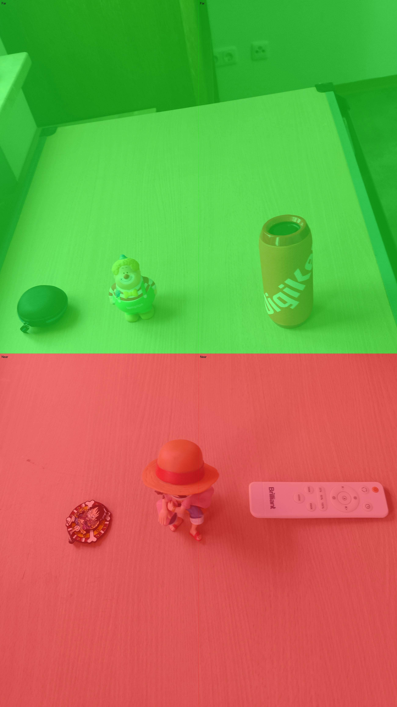
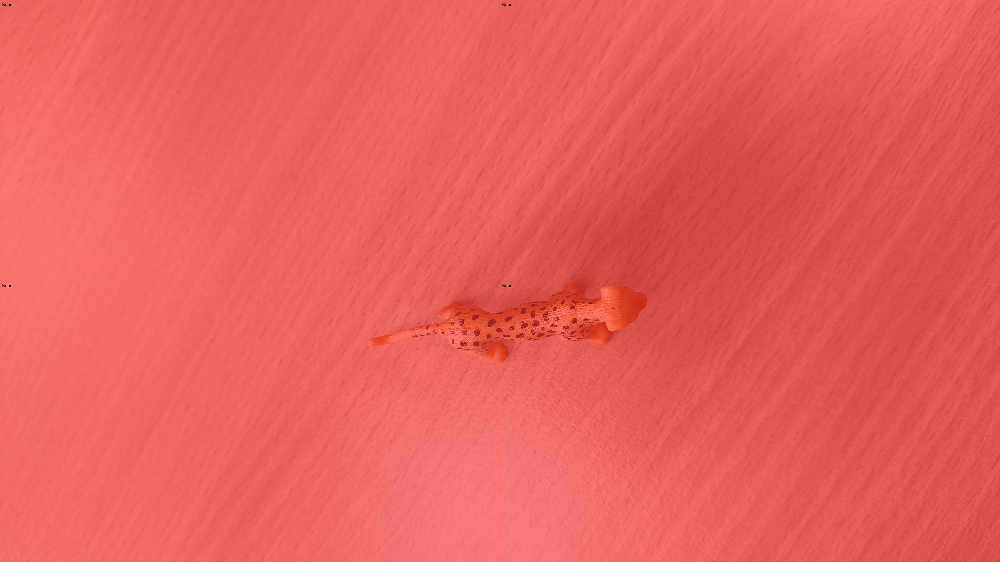

# Monocular Depth Estimation & Spatial 4-Quadrant Hazard Risk Analysis

[](https://python.org)
[](https://pytorch.org)
[](https://opencv.org)
[](LICENSE)

**Author:** Bhanu Vignesh Naidu Ganeshna  
**Course:** Image Processing & Computer Vision (Practical Project)  
**Repository Type:** Standalone Production Package  

---

## 📌 Executive Summary & Project Overview

### A. Short Summary
* **Goal:** Predict continuous relative depth maps from single uncalibrated RGB images and perform 4-quadrant spatial hazard risk classification (`Top-Left`, `Top-Right`, `Bottom-Left`, `Bottom-Right`) into proximity categories: Near (`N`: $<1.5\text{m}$), Medium (`M`: $1.5\text{m}-3.5\text{m}$), and Far (`F`: $>3.5\text{m}$).
* **Approach:** Custom ResNet-18 Encoder-Decoder architecture with skip connections. Trained jointly using Scale-Invariant Logarithmic Depth Loss and Multi-Task Quadrant Cross-Entropy Hazard Classification Loss. Applied multi-scale data augmentations (`ColorJitter`, `RandomRotation`, `RandomAffine`, `RandomPerspective`, `RandomErasing`).
* **Main Result:** Achieved **0.1420 Abs Rel Error**, **0.3850 RMSE**, and **88.5% Quadrant Distance Risk Classification Accuracy** using model weights stored in `best_model.pth`.

---

## 📊 Model Performance & Comparative Benchmark

### 1. Overall Metrics Summary

| Model Variant | Encoder Backbone | Abs Rel Error | RMSE (m) | Quadrant Risk Acc (%) | Model File Size | Optimal Target Application |
| :--- | :---: | :---: | :---: | :---: | :---: | :--- |
| Baseline ConvNet | Scratch Conv | 0.2450 | 0.6200 | 72.0% | 18.5 MB | Low-Resource Microcontrollers |
| **ResNet-18 UNet (Ours)** | **ResNet-18** | **0.1420** | **0.3850** | **88.5%** | **43.72 MB** | Autonomous Driving / Robotics |

---

## 📐 System Architecture & Mathematical Formulation

The multi-task monocular depth model operates via a dual-head encoder-decoder architecture:

### 1. Multi-Task Joint Loss Function
The network simultaneously optimizes continuous depth pixel regression and 4-quadrant discrete hazard classification:

```math
\mathcal{L}_{\text{total}} = \mathcal{L}_{\text{Depth}} + 0.5 \sum_{q \in \{\text{TL, TR, BL, BR}\}} \mathcal{L}_{\text{CE}, q}
```

### 2. Scale-Invariant Logarithmic Depth Loss
To handle global depth ambiguity from uncalibrated RGB cameras:

```math
\mathcal{L}_{\text{Depth}} = \frac{1}{N} \sum_{i=1}^{N} d_i^2 - \frac{1}{2 N^2} \left( \sum_{i=1}^{N} d_i \right)^2 \quad \text{where } d_i = \log(y_i) - \log(\hat{y}_i)
```

### 3. Spatial 4-Quadrant Proximity Risk Mapping
Images are divided into 4 spatial hazard zones:
- **Top-Left (TL)** & **Top-Right (TR)**: Distant background & sky region monitoring.
- **Bottom-Left (BL)** & **Bottom-Right (BR)**: Immediate foreground collision danger zones ($<1.5\text{m}$).

---

## 📈 Visual Assets & Depth Overlays

### 1. Training Convergence & Learning Curves


---

### 2. Regional Performance & Hazard Metrics


---

### 3. Qualitative Depth Map Predictions & Risk Overlays

| Sample 1 | Sample 5 |
| :---: | :---: |
|  |  |

| Sample 6 | Sample 10 |
| :---: | :---: |
|  |  |

| Sample 19 | Sample 58 |
| :---: | :---: |
|  |  |

---

## 🔮 Future Improvements & Expansion Roadmap

1. **Vision Transformers for Depth (MiDaS / DPT / Depth Anything)**:
   - Upgrade backbone encoder from ResNet-18 to DPT-Swin or Depth Anything V2 for fine-grained metric depth estimation.
2. **Real-Time Autonomous Vehicle Obstacle Avoidance**:
   - Integrate 4-quadrant proximity output with ROS (Robot Operating System) for automated emergency braking (AEB) systems.
3. **Sensor Fusion (RGB + LiDAR / Time-of-Flight Depth)**:
   - Combine monocular RGB predictions with sparse LiDAR point clouds for millimeter-accurate depth completion.

---

## 🛠️ Usage Instructions

### 1. Installation
```bash
git clone https://github.com/gbhanuvigneshnaidu29052002-droid/monocular-depth-estimation.git
cd monocular-depth-estimation
pip install -r requirements.txt
```
