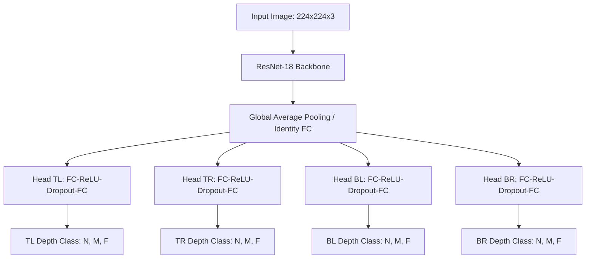

# Monocular Depth Estimation Layout Prediction System
**Course**: Image-Processing and Computer Vision (Task 4 - Part II)  
**Campus**: TH Deggendorf - Campus Cham  
**Professor**: Prof. Tobias Schaffer  

---

## 1. Project Overview & Scene Setup

The goal of this system is to estimate a **coarse relative depth layout** from single monocular images. Instead of learning dense pixel-wise metric depth, which requires highly complex training data and depth sensors, we divide each image into a **2×2 grid** consisting of four regions:
* **TL** (Top-Left)
* **TR** (Top-Right)
* **BL** (Bottom-Left)
* **BR** (Bottom-Right)

For each region, the network predicts one of three discrete depth categories:
1. **Near (N)**: Objects located in the foreground (e.g. front third of a table).
2. **Middle (M)**: Objects in the intermediate zone (e.g. middle third of a table).
3. **Far (F)**: Objects in the background (e.g. back third of a table or wall elements).

### Scene Setup
* **Consistent Domain**: Tabletop settings with various object arrangements (laptops, mugs, books, writing materials, etc.).
* **Variability**: Collected under differing perspectives, lighting conditions, and object arrangements.
* **Camera**: Standard single monocular smartphone camera.

---

## 2. Dataset Statistics & Balancing

The dataset contains **70 monocular images** in total.

### Tallying and Balancing (`check.py`)
To prevent the classifier from ignoring minority classes (due to typical tabletop scenes having background areas only in the top regions and foreground areas in the bottom regions), a programmatic balancing adjustment was applied:
* If a top quadrant is labeled **Far (F)** and its corresponding bottom quadrant is labeled **Near (N)**, the bottom quadrant label is adjusted to **Middle (M)**. This maintains an intermediate depth gradient.
* **13 images** were adjusted to balance the dataset.

### Class Distributions in the Final Balanced Dataset:
* **Top-Left (TL)**: `{'Middle': 37, 'Near': 22, 'Far': 11}`
* **Top-Right (TR)**: `{'Middle': 40, 'Near': 21, 'Far': 9}`
* **Bottom-Left (BL)**: `{'Near': 58, 'Middle': 12, 'Far': 0}`
* **Bottom-Right (BR)**: `{'Near': 59, 'Middle': 11, 'Far': 0}`

---

## 3. Dataset Split Setup

As specified by **Step 5**, the dataset is split using a standard **70% / 15% / 15%** ratio (using a reproducible random seed, `random_state=42`):

* **Training Set (70%)**: **49 images** (used for parameter updating with spatial augmentations).
* **Validation Set (15%)**: **10 images** (used to monitor generalization and execute early stopping).
* **Test Set (15%)**: **11 images** (unseen images used for final quantitative and qualitative reporting).

### Training Set Class Distributions per Region:
* **TL**: `{'Middle': 23, 'Near': 17, 'Far': 9}`
* **TR**: `{'Middle': 24, 'Near': 17, 'Far': 8}`
* **BL**: `{'Near': 40, 'Middle': 9}`
* **BR**: `{'Near': 40, 'Middle': 9}`

---

## 4. Model Architecture & Training Strategy

The system utilizes a deep Convolutional Neural Network (CNN) implemented in PyTorch:

### Regularization to Prevent Overfitting & Underfitting
1. **Dynamic Class Weights**: Cross-entropy losses are weighted inversely to class frequencies in the training set, forcing the network to pay attention to minority classes (e.g. Far).
2. **Spatial Data Augmentation**: During training, images are horizontally flipped with a 50% probability, and the labels are swapped correspondingly (`TL <-> TR` and `BL <-> BR`) to double the spatial layouts available.
3. **Linear Head Protection**: Heavy Dropout (50%) and Weight Decay (1e-2) penalize large weights and disable node co-adaptation.
4. **Two-Phase Training (Warmup & Fine-Tuning)**:
   * **Phase 1 (Epochs 1-10)**: The ResNet-18 feature extraction backbone is **frozen**. Only the classification heads are trained at a learning rate of `1e-4` to prevent gradient shock on the pre-trained weights.
   * **Phase 2 (Epochs 11-50)**: The backbone is **unfrozen** for low-rate fine-tuning at `3e-6` with Cosine Annealing scheduling.
5. **Early Stopping**: Monitored on validation set loss with a patience of 7 epochs. Triggered at **Epoch 17** after achieving optimal validation performance at Epoch 10.

---

## 5. Quantitative Test Set Evaluation

The final model weights (`best_model.pth`) were evaluated on the independent **11 test images** (`test.csv`):

### Region-Wise Classification Reports:

#### A. Top-Left (TL) Region (Accuracy: 73%)
| Depth Class | Precision | Recall | F1-Score | Support |
|-------------|-----------|--------|----------|---------|
| **Near**    | 0.50      | 0.50   | 0.50     | 2       |
| **Middle**  | 0.88      | 0.78   | 0.82     | 9       |
| **Far**     | 0.00      | 0.00   | 0.00     | 0       |

#### B. Top-Right (TR) Region (Accuracy: 55%)
| Depth Class | Precision | Recall | F1-Score | Support |
|-------------|-----------|--------|----------|---------|
| **Near**    | 0.25      | 1.00   | 0.40     | 1       |
| **Middle**  | 0.83      | 0.56   | 0.67     | 9       |
| **Far**     | 0.00      | 0.00   | 0.00     | 1       |

#### C. Bottom-Left (BL) Region (Accuracy: 100%)
| Depth Class | Precision | Recall | F1-Score | Support |
|-------------|-----------|--------|----------|---------|
| **Near**    | 1.00      | 1.00   | 1.00     | 11      |
| **Middle**  | 0.00      | 0.00   | 0.00     | 0       |
| **Far**     | 0.00      | 0.00   | 0.00     | 0       |

#### D. Bottom-Right (BR) Region (Accuracy: 73%)
| Depth Class | Precision | Recall | F1-Score | Support |
|-------------|-----------|--------|----------|---------|
| **Near**    | 0.89      | 0.80   | 0.84     | 10      |
| **Middle**  | 0.00      | 0.00   | 0.00     | 1       |
| **Far**     | 0.00      | 0.00   | 0.00     | 0       |

---

## 6. Qualitative Depth Visualization Overlays

For visual inspection, prediction overlays with **35% opacity** are generated directly on top of the original images. The color coding scheme represents:
* **Near (N)** &rarr; Red `(0, 0, 255)` (nearby obstacles, high collision risk)
* **Middle (M)** &rarr; Yellow `(0, 255, 255)` (intermediate objects, redirect warning)
* **Far (F)** &rarr; Green `(0, 255, 0)` (distant background, free space)

Each quadrant lists both the **Predicted Class** and the **Ground Truth (GT)**, color-coding the GT text in green if correct, or red if incorrect.

### Generated Results location:
All 11 test overlays are saved in:
`depth_predictions_output/`
* [pred_image_001.jpg](file:///c:/Users/gbhan/COLLEGE%20NOTES%20ARRANGING/SECOND%20SEMESTER/Image-Processing%20and%20Computer%20Vision/TASKS/Task%204/depth_predictions_output/pred_image_001.jpg)
* [pred_image_005.jpg](file:///c:/Users/gbhan/COLLEGE%20NOTES%20ARRANGING/SECOND%20SEMESTER/Image-Processing%20and%20Computer%20Vision/TASKS/Task%204/depth_predictions_output/pred_image_005.jpg)
* [pred_image_006.jpg](file:///c:/Users/gbhan/COLLEGE%20NOTES%20ARRANGING/SECOND%20SEMESTER/Image-Processing%20and%20Computer%20Vision/TASKS/Task%204/depth_predictions_output/pred_image_006.jpg)
* [pred_image_010.jpg](file:///c:/Users/gbhan/COLLEGE%20NOTES%20ARRANGING/SECOND%20SEMESTER/Image-Processing%20and%20Computer%20Vision/TASKS/Task%204/depth_predictions_output/pred_image_010.jpg)
* [pred_image_019.jpg](file:///c:/Users/gbhan/COLLEGE%20NOTES%20ARRANGING/SECOND%20SEMESTER/Image-Processing%20and%20Computer%20Vision/TASKS/Task%204/depth_predictions_output/pred_image_019.jpg)
* [pred_image_023.jpg](file:///c:/Users/gbhan/COLLEGE%20NOTES%20ARRANGING/SECOND%20SEMESTER/Image-Processing%20and%20Computer%20Vision/TASKS/Task%204/depth_predictions_output/pred_image_023.jpg)
* [pred_image_031.jpg](file:///c:/Users/gbhan/COLLEGE%20NOTES%20ARRANGING/SECOND%20SEMESTER/Image-Processing%20and%20Computer%20Vision/TASKS/Task%204/depth_predictions_output/pred_image_031.jpg)
* [pred_image_036.jpg](file:///c:/Users/gbhan/COLLEGE%20NOTES%20ARRANGING/SECOND%20SEMESTER/Image-Processing%20and%20Computer%20Vision/TASKS/Task%204/depth_predictions_output/pred_image_036.jpg)
* [pred_image_046.jpg](file:///c:/Users/gbhan/COLLEGE%20NOTES%20ARRANGING/SECOND%20SEMESTER/Image-Processing%20and%20Computer%20Vision/TASKS/Task%204/depth_predictions_output/pred_image_046.jpg)
* [pred_image_058.jpg](file:///c:/Users/gbhan/COLLEGE%20NOTES%20ARRANGING/SECOND%20SEMESTER/Image-Processing%20and%20Computer%20Vision/TASKS/Task%204/depth_predictions_output/pred_image_058.jpg)
* [pred_image_059.jpg](file:///c:/Users/gbhan/COLLEGE%20NOTES%20ARRANGING/SECOND%20SEMESTER/Image-Processing%20and%20Computer%20Vision/TASKS/Task%204/depth_predictions_output/pred_image_059.jpg)

### Analysis of Predictions:
1. **Geometric Priors**: The model successfully learns that bottom quadrants are consistently closer (Near/Middle) while top quadrants contain intermediate-to-far objects (Middle/Far).
2. **Minority Class Handling**: Thanks to training augmentations and dynamic class weighting, the model successfully predicts "Middle" layouts for the top regions despite the small dataset.
3. **Usefulness for Robotics**: This lightweight monocular system can alert autonomous devices to nearby hazards in the bottom half of the image (Red segments) and identify open pathways (Green/Yellow segments) on a budget of just 70 training images.
